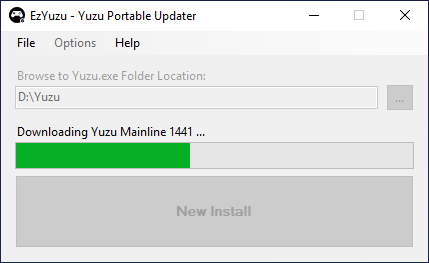
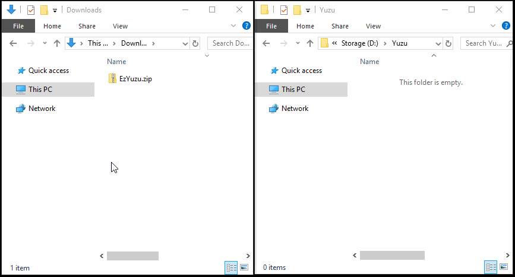

# EzYuzu

A Portable Yuzu Updater for Standalone versions of Yuzu Mainline or Early Access (EA).

Perfect for those who run Yuzu off an External HDD or through (but not limited to) frontends such as LaunchBox, Steam, EmulationStation and HyperSpin.

## Table of Contents

- [Overview](#overview)
  - [Methodology](#methodology)
  - [Basic Usage](#basic-usage)
- [Download](#downloads)
- [Installation](#installation)
- [User Guide](#user-guide)
- [Acknowledgements](#acknowledgements)

## Overview

### Methodology

- Reads [Yuzu Mainline](https://github.com/yuzu-emu/yuzu-mainline/releases/latest) or [Yuzu Early Access (EA)](https://github.com/pineappleEA/pineapple-src/releases/latest) JSON data
- Fetches the latest `.7z` or `.zip` archive URL
- Downloads & extracts it into your Yuzu Root Folder

### Basic Usage

1. Browse and locate the your Yuzu Root Folder, this is the folder containing `yuzu.exe`
2. EzYuzu will automatically detect the version of `yuzu.exe`
3. (Optional): Change Update Channel and/or Update Version
4. Click on `New Install` or `Update Yuzu`

- Downloads the latest copy of yuzu & extracts it into your Yuzu Root Folder.
- Automatically checks if your standalone copy of Yuzu is up-to-date.
- `Dependencies` are automatically installed when EzYuzu is ran as Administrator.
- `Update Channel` and `Update Version` can be overridden by checking the options within `Options` > `Advanced`
- It shouldn't overwrite configs unless `New Install` is displayed. However, backup beforehand.
- Temp files are stored within `TempUpdate` and are deleted upon completion.
- [GUIDE](https://github.com/amakvana/EzYuzu/blob/master/GUIDE.md) for detailed instructions, along with [Command Line options](https://github.com/amakvana/EzYuzu/blob/master/GUIDE.md#command-line-interface-options).

## Downloads

https://github.com/amakvana/EzYuzu/releases/latest

Requires:

- Latest [7-Zip](https://www.7-zip.org/a/7z2201-x64.msi) installed.
- Latest [.NET 7 Desktop Runtime](https://dotnet.microsoft.com/en-us/download/dotnet/thank-you/runtime-desktop-7.0.5-windows-x64-installer) installed.
- Latest [Visual C++ X64 Redistributable](https://aka.ms/vs/16/release/vc_redist.x64.exe) installed.

## Installation

Extract the entire contents of the `EzYuzu.zip` file, including all `.dll` files, into a folder and run `EzYuzu.exe`

EzYuzu is 100% portable - it can be run from any location.

EzYuzu does not require Administrator privileges to update Yuzu.

Running as Administrator will install Visual C++ Redistributables dependencies.

## User Guide

The User Guide can be found [here](https://github.com/amakvana/EzYuzu/blob/master/GUIDE.md)

## Acknowledgements

Thanks:

- [Yuzu Team](https://yuzu-emu.org/) - Nintendo Switch Emulator Developers
- [PineappleEA](https://github.com/pineappleEA/pineapple-src) - Early Access Builds
- [Stellar](https://github.com/StellarUpdater/Stellar) - Inspiration
- [Agus Raharjo](https://www.iconfinder.com/agusraharj) - Icons
